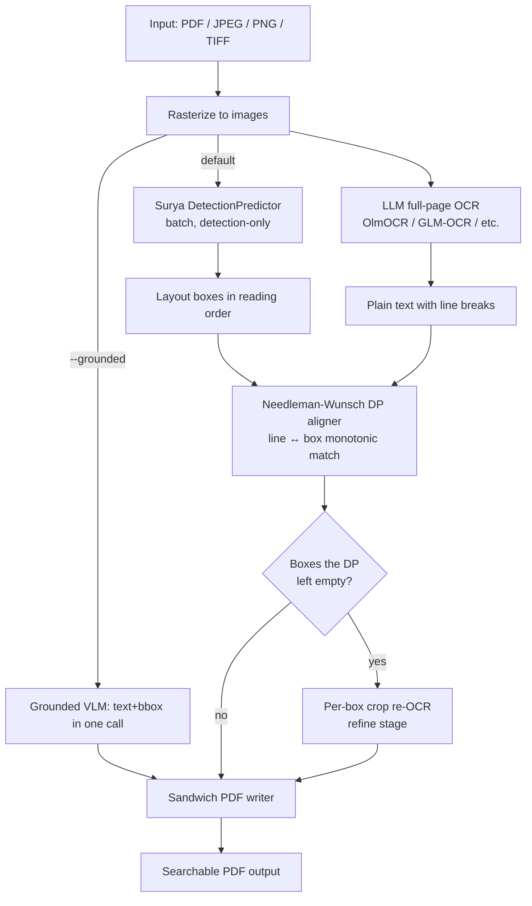

# 📄 Local LLM PDF OCR

[](https://python.org)
[](https://fastapi.tiangolo.com)
[](LICENSE)
[](https://lmstudio.ai)

> **Transform scanned and written documents into fully searchable, selectable PDFs using the power of Local LLM Vision.**

**PDF LLM OCR** is a next-generation OCR tool that moves beyond traditional Tesseract-based scanning. By leveraging OCR Vision Language Models (VLMs) like `olmOCR` running locally on your machine, it "reads" documents with human-like understanding while keeping 100% of your data private.

---

## ✨ Features

-   **🧠 AI-Powered Vision**: Uses advanced VLMs to transcribe text with high accuracy, even on complex layouts or noisy scans.
-   **🤝 DP-Based Text↔Box Alignment**: **Surya OCR** detects layout boxes; a **Local LLM** transcribes the whole page; a Needleman-Wunsch dynamic-programming aligner binds LLM lines to the correct boxes in reading order, with a per-box crop re-OCR fallback for boxes the DP cannot confidently populate.
-   **🛰️ Grounded Path (opt-in)**: Point the tool at a bbox-native VLM (Qwen2.5-VL, Qwen3-VL, MinerU, Florence-2, …) with `--grounded` and it skips Surya/DP/refine entirely — the model returns text + coordinates in a single call.
-   **🖼️ PDF or Raw Image Input**: Accepts **`.pdf`, `.jpg`, `.jpeg`, `.png`, `.bmp`, `.webp`, `.tif`/`.tiff`**. Multi-frame TIFFs become multi-page output PDFs — no manual PDF-wrap step.
-   **⚡ Fast Detection**: Surya runs in detection-only mode (no recognition) and batches across pages.
-   **🔒 100% Local & Private**: No cloud APIs, no subscription fees. Run it entirely offline using [LM Studio](https://lmstudio.ai) or [Ollama](https://ollama.com).
-   **🔍 Searchable Outputs**: Embeds an invisible text layer into a sandwich PDF. Glyph bboxes are horizontally scaled so selection in a PDF viewer covers the full width of each text region.
-   **🖥️ Dual Interfaces**:
    -   **Web UI**: Drag & drop, Dark Mode, real-time per-page progress.
    -   **CLI**: Documented flags for power users and batch automation, Rich progress bars.
-   **🧪 Tested**: 145-test suite covering DP invariants, embedding geometry, grounded JSON parsing, and end-to-end runs against the example PDFs.

---

## 🏗️ Architecture

The tool has two execution paths behind a single `OCRPipeline` seam (`src/pdf_ocr/pipeline.py`). The default **hybrid path** works with any OCR-capable VLM; the opt-in **grounded path** collapses the whole flow into one call for VLMs that emit text+bbox natively.



### How It Works

1. **Input**: PDFs *or* raw images. Multi-frame TIFFs expand to one page per frame. Images skip the PDF round-trip and feed straight into the pipeline.

2. **Batch Layout Detection** *(hybrid path)*: Surya's `DetectionPredictor` processes all pages in one call, ~10-21× faster than running full recognition.

3. **LLM Text Extraction** *(hybrid path)*: A local vision model (OlmOCR by default via LM Studio) transcribes each page's full content with human-like understanding.

4. **Needleman-Wunsch Alignment** *(hybrid path)*: The DP aligner binds each LLM line to its Surya box using character-count fit + reading-order monotonicity. Cheap `skip_box` ops (many detected boxes are rules/decorations), expensive `skip_line` ops — but unmatched lines are attached to the nearest matched box so no LLM text is lost.

5. **Refine Fallback** *(hybrid path, optional)*: Any sizeable box the DP couldn't populate gets its image crop re-OCR'd individually. Catches tables/multi-column/figure captions without paying N× latency on clean prose. Disable with `--no-refine`.

6. **Grounded Path** *(opt-in alternative)*: With `--grounded` pointed at a bbox-native VLM (Qwen2.5-VL, Qwen3-VL, MinerU, …), the model returns `{bbox, text}` tuples in a single call — Surya, DP, and refine are all skipped.

7. **Sandwich PDF**: The page is rasterized as a background image and invisible text is overlaid with horizontal-scale matrices so glyph bboxes span the full width of each source box — selection in a PDF viewer correctly covers the whole region.

---

## 🚀 Getting Started

### Prerequisites

1.  **Python 3.10+**
2.  **A local OpenAI-compatible LLM server**. Any of:
    -   **[LM Studio](https://lmstudio.ai)** — recommended default. Load `allenai/olmocr-2-7b` (hybrid path) or `qwen/qwen3-vl-8b` / `qwen/qwen2.5-vl-7b` (grounded path). Start the local server (default port `1234`).
    -   **[Ollama](https://ollama.com)** — pull `glm-ocr:latest` (requires `--max-image-dim 640`) or any vision model. Served at `http://localhost:11434/v1`.
    -   **vLLM / SGLang / any OpenAI-compatible endpoint**.

### Configuration

Create a `.env` file in the root directory to configure your Local LLM:

```env
LLM_API_BASE=http://localhost:1234/v1
LLM_MODEL=allenai/olmocr-2-7b
```

### Installation

This project is managed with [`uv`](https://github.com/astral-sh/uv) for lightning-fast dependency management.

1.  **Install `uv`** (if not installed):

    ```bash
    pip install uv
    ```

2.  **Clone the repository**:

    ```bash
    git clone https://github.com/ahnafnafee/pdf-ocr-llm.git
    cd pdf-ocr-llm
    ```

3.  **Sync Dependencies**:
    ```bash
    uv sync
    ```

---

## Usage

### 1. 🌐 Web Interface (Recommended)

The easiest way to use the tool. Features a modern dashboard with Dark Mode and Text Preview.

1.  **Start the Server**:
    ```bash
    uv run uvicorn server:app --reload --port 8000
    ```
2.  Open your browser to `http://localhost:8000`.
3.  **Drag & Drop** your PDF.
4.  Watch the magic happen! ✨
    -   **Real-time Progress**: Track per-page OCR status.
    -   **Preview**: Click "View Text" to inspect the raw AI extraction.
    -   **Dark Mode**: Toggle the moon icon for a sleek dark theme.

### 2. 💻 Command Line Interface (CLI)

Perfect for developers or integrating into scripts.

Run the OCR tool on any PDF:

```bash
uv run main.py input.pdf output_ocr.pdf
```

**Options**:

| Option                    | Description                                                           |
| ------------------------- | --------------------------------------------------------------------- |
| `input_pdf`               | Path to input PDF (required)                                          |
| `output_pdf`              | Path to output PDF (optional, defaults to `<input>_ocr.pdf`)          |
| `-v`, `--verbose`         | Enable debug logging (alignment details, box counts)                  |
| `-q`, `--quiet`           | Suppress all output except errors                                     |
| `--dpi <int>`             | DPI for image rendering (default: 200)                                |
| `--pages <range>`         | Page range to process, e.g., `1-3,5` (default: all)                   |
| `--concurrency <int>`     | Parallel LLM requests (default: 1)                                    |
| `--no-refine`             | Skip per-box crop re-OCR (faster, less robust on tables/multi-column) |
| `--max-image-dim <int>`   | Longest-edge px cap for page images (default: 1024; see note below)   |
| `--api-base <url>`        | Override LLM API base URL                                             |
| `--model <name>`          | Override LLM model name                                               |

**Examples**:

```bash
# Basic usage (auto-generates input_ocr.pdf, uses LM Studio + OlmOCR)
uv run main.py scan.pdf

# Specific pages with higher rendering DPI
uv run main.py document.pdf output.pdf --pages 1-5 --dpi 300

# Parallel LLM calls on a multi-page doc
uv run main.py long.pdf --concurrency 3

# Use Ollama + GLM-OCR instead of LM Studio
uv run main.py scan.pdf \
    --api-base http://localhost:11434/v1 \
    --model glm-ocr:latest \
    --max-image-dim 640

# Grounded path: bbox-native VLM (Qwen2.5-VL / Qwen3-VL) — skips Surya, DP, refine
uv run main.py scan.pdf --grounded \
    --api-base http://localhost:1234/v1 \
    --model qwen/qwen3-vl-8b

# Raw image input — no PDF required. Accepts JPEG/PNG/BMP/WebP, and
# multi-page TIFFs (each frame becomes one page in the output PDF).
uv run main.py scan.png scan_ocr.pdf
uv run main.py archive.tiff archive_ocr.pdf
```

### Two pipeline paths

| Path | Flag | Detection | Text | Alignment | Refine | When to use |
|------|------|-----------|------|-----------|--------|-------------|
| **Hybrid** (default) | _none_ | Surya | LLM full-page | DP | Per-box crop | Text-only VLMs (OlmOCR, GLM-OCR); max coverage |
| **Grounded** | `--grounded` | — | Bbox-native VLM returns both | — | — | Qwen2.5/3-VL, MinerU, etc.; simpler, fewer moving parts |

The hybrid path is the safe default: it works with *any* OCR-capable VLM, including models that can only return plain text. The grounded path is faster and eliminates the DP-alignment class of bugs entirely, but requires a VLM that emits `{"bbox_2d": [...], "content": "..."}` JSON when asked (Qwen2.5-VL / Qwen3-VL confirmed working; others untested).

> **Note on `--max-image-dim`**: small local VLMs have tight context windows.
> OlmOCR-2-7B (Qwen2.5-VL base) is happy with the 1024 default.
> **GLM-OCR:1.1B via Ollama crashes its runner above ~640 px**, so drop the
> cap when you use it. If Ollama dies mid-run, restart it with `ollama serve`
> and lower `--max-image-dim`.

_You'll see animated progress bars showing detection, LLM OCR, refinement, and embedding._

---

## 📁 Project Structure

```
local-llm-pdf-ocr/
├── src/pdf_ocr/
│   ├── pipeline.py            # OCRPipeline orchestration seam (hybrid + grounded)
│   ├── core/
│   │   ├── aligner.py         # HybridAligner: Surya detect + Needleman-Wunsch DP
│   │   ├── ocr.py             # OCRProcessor: OpenAI-compat LLM client + crop OCR
│   │   ├── pdf.py             # PDFHandler: PDF/image I/O + sandwich-PDF embedding
│   │   └── grounded.py        # Grounded backends (PromptedGroundedOCR, ZAIHostedOCR) + parsers
│   ├── evaluation.py          # Confidence comparator (IoU + text similarity)
│   └── utils/
│       ├── image.py           # Crop utility for the refine stage
│       └── tqdm_patch.py      # Silences Surya's internal progress bars
├── tests/                     # 145-test suite (fast tier + Surya-integration tier)
│   └── fixtures/              # Ground-truth JSON for confidence evaluation
├── scripts/
│   ├── confidence_eval.py     # Score either path against ground-truth fixtures
│   ├── debug_alignment.py     # Visualize alignment for a single PDF
│   ├── visualize_bboxes.py    # Render Surya's detected boxes
│   └── ...                    # Other debug tools
├── static/                    # Web UI assets
├── examples/                  # Sample PDFs (digital, hybrid, handwritten)
├── main.py                    # CLI entry point
└── server.py                  # FastAPI web server
```

---

## 🛠️ Tech Stack

-   **Backend**: FastAPI (Async Web Framework)
-   **Frontend**: Vanilla JS + CSS Variables
-   **PDF Processing**: PyMuPDF (Fitz)
-   **Layout Detection**: Surya OCR (Detection-only mode)
-   **AI Integration**: OpenAI Client (compatible with Local LLM servers)
-   **CLI UI**: Rich (Terminal formatting)

---

## ⚡ Performance

Detection is no longer the bottleneck — full-page LLM OCR is. Rough per-page timings on a warm run (Surya loaded, LM Studio serving OlmOCR-2-7B on a single GPU):

| Phase | Time / page | Notes |
|---|---|---|
| Rasterize PDF → image | ~0.3 s | Linear in pages |
| Surya batch detection | ~0.5 s | Amortized across all pages in one call |
| **LLM full-page OCR** | **~2–4 s** | **Dominant cost.** Set `--concurrency 3` to parallelize on multi-page docs |
| Per-box refine (if needed) | ~0.5–1 s × empty boxes | Typically 0–2 s; `--no-refine` to skip |
| PDF assembly | ~0.2 s | Linear in pages |
| Cold-start Surya load | +5–10 s (once) | Paid even on `--grounded` runs |

On our three example PDFs (hybrid path, `allenai/olmocr-2-7b`, warm): digital ≈ 14 s, hybrid ≈ 5 s, handwritten ≈ 4 s.

---

## 🧪 Testing

```bash
uv run pytest                      # full suite (~75s, loads Surya once)
uv run pytest -m "not slow"        # fast tier (~15s, no model loads)
uv run pytest tests/test_aligner.py -v
```

Confidence evaluation (needs a live LLM endpoint):

```bash
uv run scripts/confidence_eval.py --path both \
    --grounded-model qwen/qwen3-vl-8b \
    --hybrid-model allenai/olmocr-2-7b
```

Scores either path against the fixtures in `tests/fixtures/ground_truth_*.json` — block recall at IoU≥0.3, average IoU of matched pairs, average text similarity.

---

## 🤝 Contributing

Contributions are welcome! Please feel free to submit a Pull Request.

**License**: MIT
