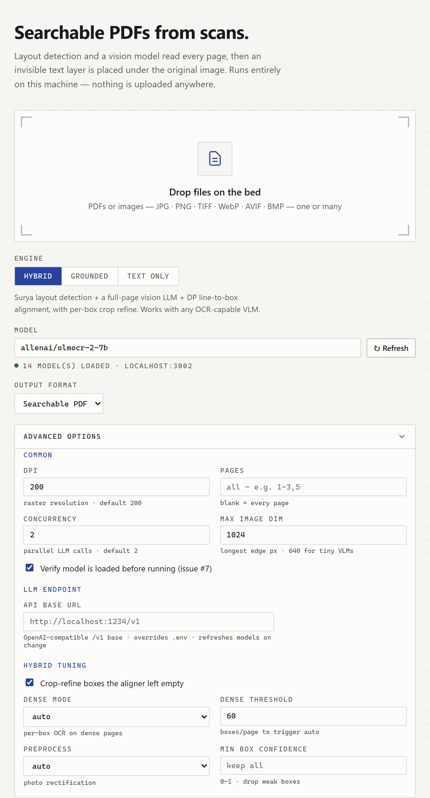
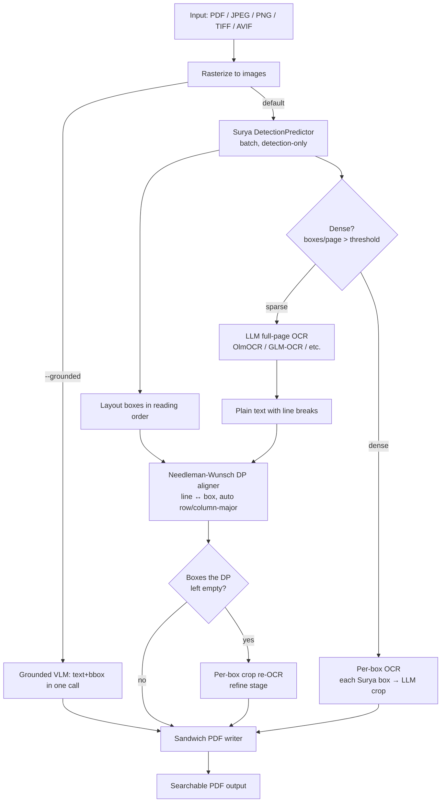

<a id="top"></a>

<div align="center">


<h1>📄 Local LLM PDF OCR</h1>

**Turn scanned PDFs and images into fully searchable, selectable documents — with a local vision LLM.**<br/>
No cloud. No API keys. Nothing ever leaves your machine.

<br/>

[](https://python.org)
[](https://fastapi.tiangolo.com)
[](LICENSE)
[](https://lmstudio.ai)
[](https://github.com/ahnafnafee/local-llm-pdf-ocr/stargazers)
[](https://github.com/ahnafnafee/local-llm-pdf-ocr/issues)

**[Features](#-features) · [Getting Started](#-getting-started) · [Usage](#-usage) · [Architecture](#-architecture) · [Performance](#-performance)**

</div>

> **Local LLM PDF OCR** moves beyond traditional Tesseract-based scanning. By pointing it at an OCR Vision Language Model (VLM) like `olmOCR`, `Qwen3-VL`, or `GLM-OCR` running locally, it *reads* documents with human-like understanding — then writes an invisible, selectable text layer back under the original image. Drive it from a **configurable web UI** or a **fully-flagged CLI**.

<br/>

<details>
<summary><b>📑 Table of Contents</b></summary>

- [✨ Features](#-features)
- [🖥️ The Interface](#️-the-interface)
- [🏗️ Architecture](#-architecture)
- [🚀 Getting Started](#-getting-started)
- [📖 Usage](#-usage)
  - [Web Interface](#1--web-interface-recommended)
  - [Command Line](#2--command-line-interface-cli)
  - [Two pipeline paths](#two-pipeline-paths)
- [📁 Project Structure](#-project-structure)
- [🛠️ Tech Stack](#️-tech-stack)
- [⚡ Performance](#-performance)
- [🧪 Testing](#-testing)
- [🤝 Contributing](#-contributing)

</details>

---

## ✨ Features

- **🧠 AI-Powered Vision** — Advanced VLMs transcribe text with high accuracy, even on complex layouts or noisy scans.
- **🎛️ Fully Configurable — CLI *and* Web** — Pick the **engine**, choose the **model** (auto-discovered from your running server), point at any **endpoint**, and tune every advanced knob. The web UI now exposes the same surface the CLI does ([#21](https://github.com/ahnafnafee/local-llm-pdf-ocr/issues/21)).
- **🤝 DP-Based Text↔Box Alignment** — **Surya** detects layout boxes; a **local LLM** transcribes the whole page; a Needleman–Wunsch dynamic-programming aligner binds LLM lines to the correct boxes in reading order, with a per-box crop re-OCR fallback for boxes the DP can't confidently populate.
- **🛰️ Grounded Path (opt-in)** — Point at a bbox-native VLM (Qwen2.5-VL, Qwen3-VL, MinerU, Florence-2, …) and it skips Surya/DP/refine entirely — the model returns text + coordinates in a single call.
- **⚡ Text-Only Fast Path (opt-in)** — OCRs each page's full text and dumps it as plain text: no Surya, no alignment, no detection-model load. Trades searchable-PDF positioning for raw text at a fraction of the time.
- **🖼️ PDF or Raw Image Input** — Accepts **`.pdf`, `.jpg`, `.jpeg`, `.png`, `.bmp`, `.webp`, `.tif`/`.tiff`, `.avif`** — in *both* the CLI and the web UI. Multi-frame TIFFs become multi-page output.
- **🔒 100% Local & Private** — No cloud APIs, no subscription fees. Runs entirely offline via [LM Studio](https://lmstudio.ai), [Ollama](https://ollama.com), vLLM, or any OpenAI-compatible endpoint.
- **🔍 Four Output Formats** — Searchable sandwich **PDF** (default), **HTML** overlay, plain **Markdown**, or plain **text**. Pick via `--format`, the output extension, or the web dropdown.
- **📚 Dense-Page Mode** — Auto-detects densely-laid-out pages (default > 60 boxes) and switches to per-box OCR — bypassing the loops / hallucination that full-page OCR exhibits on dense handwritten content.
- **🧪 Tested** — A comprehensive suite (455 fast + 29 Surya-integration) covers DP invariants, reading-order auto-detection, blank-crop / pangram filters, embedding geometry, grounded JSON parsing, the HTML / Markdown / text writers, evaluation metrics, CLI dispatch, and the full server option surface.

<div align="right"><sub><a href="#top">↑ back to top</a></sub></div>

---

## 🖥️ The Interface

The web UI stays clean by default — drop a file, pick an engine, run — with the **full CLI option surface** one click away under **Advanced**. Dark mode included.

<div align="center">


<br/><br/>
<em>Engine · model · endpoint · DPI · pages · concurrency · dense-mode · preprocessing · HTML tuning — all of it, progressively disclosed.</em>
<br/><br/>

</div>

<div align="right"><sub><a href="#top">↑ back to top</a></sub></div>

---

## 🏗️ Architecture

The tool has two execution paths behind a single `OCRPipeline` seam (`src/pdf_ocr/pipeline.py`). The default **hybrid path** works with any OCR-capable VLM; the opt-in **grounded path** collapses the whole flow into one call for VLMs that emit text+bbox natively.


```mermaid
graph TD
    A[Input: PDF / JPEG / PNG / TIFF / AVIF] --> B[Rasterize to images]
    B -->|--grounded| Z[Grounded VLM: text+bbox in one call]
    Z --> EMB

    B -->|default| C[Surya DetectionPredictor<br/>batch, detection-only]
    C --> DM{Dense?<br/>boxes/page > threshold}
    DM -->|sparse| D[LLM full-page OCR<br/>OlmOCR / GLM-OCR / etc.]
    DM -->|dense| P[Per-box OCR<br/>each Surya box → LLM crop]
    D --> F[Plain text with line breaks]
    C --> E[Layout boxes in reading order]
    E --> G[Needleman-Wunsch DP aligner<br/>line ↔ box, auto row/column-major]
    F --> G
    G --> H{Boxes the DP<br/>left empty?}
    H -->|yes| R[Per-box crop re-OCR<br/>refine stage]
    H -->|no| EMB[Sandwich PDF writer]
    R --> EMB
    P --> EMB
    EMB --> L[Searchable PDF output]
```

### How It Works

1. **Input** — PDFs *or* raw images. Multi-frame TIFFs expand to one page per frame. Images skip the PDF round-trip and feed straight into the pipeline.

2. **Batch Layout Detection** *(hybrid path)* — Surya's `DetectionPredictor` processes all pages in one call, ~10-21× faster than running full recognition.

3. **LLM Text Extraction** *(hybrid path)* — A local vision model transcribes each page's full content. **Dense pages (> 60 detected boxes by default) automatically switch to per-box OCR** — the model sees one Surya box at a time, avoiding the loop / hallucination failure modes of full-page OCR on dense handwritten content. On dense *machine-print* pages each crop also masks the page's other detected boxes to paper-white so tightly-stacked neighbouring lines can't leak into the transcription (handwriting pages skip the masks — strokes wander outside their boxes), and overlapping detections are deduplicated afterwards.

4. **Needleman-Wunsch Alignment** *(hybrid path, full-page mode)* — The DP aligner binds each LLM line to its Surya box using character-count fit + reading-order monotonicity. **Model-agnostic**: it tries both row-major and column-major box orderings and picks the lower-cost result, so it works whether the LLM emits column-by-column (OlmOCR-2) or row-by-row (Qwen-VL). Unmatched lines are attached to the nearest matched box so no LLM text is lost.

5. **Refine Fallback** *(hybrid path, optional)* — Any sizeable box the DP couldn't populate gets its image crop re-OCR'd individually. A pre-OCR blank-crop check (pixel stddev) skips dotted notebook backgrounds to avoid the model's "The quick brown fox..." pangram fallback. Disable with `--no-refine`.

6. **Grounded Path** *(opt-in alternative)* — With a bbox-native VLM, the model returns `{bbox, text}` tuples in a single call — Surya, DP, and refine are all skipped.

7. **Sandwich PDF** — The page is rasterized as a background image and invisible text is overlaid with horizontal-scale matrices so glyph bboxes span the full width of each source box — selection in a PDF viewer correctly covers the whole region.

<div align="right"><sub><a href="#top">↑ back to top</a></sub></div>

---

## 🚀 Getting Started

### Prerequisites

1. **Python 3.10+**
2. **A local OpenAI-compatible LLM server**. Any of:
   - **[LM Studio](https://lmstudio.ai)** — recommended default. Load `allenai/olmocr-2-7b` (hybrid path) or `qwen/qwen3-vl-8b` / `qwen/qwen2.5-vl-7b` (grounded path). Start the local server (default port `1234`). A pre-flight check confirms the requested model is actually loaded — LM Studio otherwise silently falls back to whatever is loaded, producing subtly wrong OCR ([#7](https://github.com/ahnafnafee/local-llm-pdf-ocr/issues/7)). Use `--no-verify-model` (or untick it in the UI) to skip on servers without `/v1/models`.
   - **[Ollama](https://ollama.com)** — pull `glm-ocr:latest` (needs `--max-image-dim 640`) or any vision model. Served at `http://localhost:11434/v1`.
   - **vLLM / SGLang / any OpenAI-compatible endpoint**.

### Configuration

Create a `.env` file in the root directory to configure your Local LLM:

```env
LLM_API_BASE=http://localhost:1234/v1
LLM_MODEL=allenai/olmocr-2-7b
```

These are the **defaults** — the CLI (`--api-base` / `--model`) and the web UI (Model picker + Advanced → Endpoint) override them per run.

### Installation

Managed with [`uv`](https://github.com/astral-sh/uv) for lightning-fast dependency management.

1. **Install `uv`** (if not installed):

   ```bash
   # macOS / Linux
   curl -LsSf https://astral.sh/uv/install.sh | sh
   # Windows
   powershell -c "irm https://astral.sh/uv/install.ps1 | iex"
   # …or, if you already have Python:
   pip install uv
   ```

2. **Clone the repository**:

   ```bash
   git clone https://github.com/ahnafnafee/local-llm-pdf-ocr.git
   cd local-llm-pdf-ocr
   ```

3. **Sync dependencies**:

   ```bash
   uv sync                       # CLI only
   uv sync --extra web           # CLI + FastAPI server
   ```

> **Heads up:** Surya downloads its detection model from Hugging Face Hub on first run (~500 MB, cached afterwards). The hybrid/grounded LLM is *your* responsibility — bring up LM Studio, Ollama, vLLM, or any other OpenAI-compatible vision endpoint before running OCR.

<div align="right"><sub><a href="#top">↑ back to top</a></sub></div>

---

## 📖 Usage

### 1. 🌐 Web Interface (Recommended)

A modern dashboard with dark mode, live per-page progress, a text preview, and the **full option surface**.

```bash
uv run local-llm-pdf-ocr-server --port 8000
```

Open `http://localhost:8000`, then:

1. **Drop** a PDF or image (one or many).
2. **Pick an engine** — Hybrid · Grounded · Text-only. The panel adapts to show only the relevant options.
3. **Choose a model** — auto-discovered from your running endpoint (or type any name). Point at a different **endpoint** under Advanced.
4. **Tune** DPI, pages, concurrency, dense-mode, preprocessing, HTML overlay options — or just hit **Run OCR**.
5. **Download** each result, or click **View text** to inspect the raw extraction.

### 2. 💻 Command Line Interface (CLI)

Perfect for developers, scripting, and batch automation.

```bash
uv run local-llm-pdf-ocr input.pdf output_ocr.pdf
```

**Options**:

| Option                    | Description                                                           |
| ------------------------- | --------------------------------------------------------------------- |
| `input`                   | Path to a PDF **or** image file (`.jpg`/`.jpeg`/`.png`/`.bmp`/`.webp`/`.tif`/`.tiff`/`.avif`). Required. Multi-frame TIFFs expand to multiple output pages. |
| `output`                  | Path to output file (optional). Format is inferred from the extension: `.pdf` (default, searchable PDF), `.html` / `.htm` (HTML overlay), `.md` / `.markdown` (Markdown text), `.txt` (plain text). Defaults to `<input_stem>_ocr.<format>`. |
| `--format {pdf,html,md,txt}` | Output format. Used to pick the extension when `output` is omitted, OR to override an unrecognized extension. If `output` has a recognized extension, the extension wins. `--text-only` defaults this to `txt`. |
| `--html-mode {letter-spacing,full-height,scaled}` | Sizing strategy for HTML overlay spans (ignored for pdf/md). `scaled` (default) fits the font to the box server-side, then a page-load script measures each span in its rendered font and stretches it to the exact box width via CSS `scaleX` (the PDF.js textLayer approach); without JavaScript the server-side fit still applies. `letter-spacing` stretches glyphs to fill the bbox via letter-spacing. `full-height` uses natural monospace width — text may overflow the bbox right edge. |
| `--html-inline-images`    | Embed page images as base64 `data:` URLs inside the HTML (single self-contained file at ~35% size inflation). Default behaviour writes external images: a relative reference to the input file for single-frame browser-native images, or sidecar JPEGs named `<output_stem>_p<N>.jpg` next to the output HTML for PDFs and multi-frame inputs. |
| `--html-invert-dark`      | Invert page images in dark mode (HTML output only). Adds CSS `filter: invert() hue-rotate(180deg)` that activates when the OS / browser is in dark colour scheme. |
| `--html-hover-text`       | Reveal the invisible OCR text on hover/focus (HTML output only): hovering a region shows its bound text white on a dark backdrop, for inspecting the OCR layer. |
| `-v`, `--verbose`         | Enable debug logging (alignment details, box counts)                  |
| `-q`, `--quiet`           | Suppress all output except errors                                     |
| `--dpi <int>`             | DPI for image rendering (default: 200)                                |
| `--pages <range>`         | Page range to process, e.g., `1-3,5` (default: all)                   |
| `--concurrency <int>`     | Parallel in-flight LLM requests (default: 2). Never loads extra model copies: queuing servers (LM Studio / Ollama defaults) hold excess requests at zero VRAM cost; parallel-slot servers (vLLM) spend KV-cache VRAM per active request, hence the conservative default. Raise to 4-5 for `--dense-mode always` when your server has headroom. |
| `--no-refine`             | Skip per-box crop re-OCR (faster, less robust on tables/multi-column) |
| `--text-only`             | Fast path: OCR each page's full text and write it as plain text, skipping Surya layout detection, DP alignment, and crop re-OCR entirely (no detection-model load). Naturally parallel (raise `--concurrency`). Output defaults to `<input_stem>_ocr.txt`. |
| `--max-image-dim <int>`   | Longest-edge px cap for page images (default: 1024; see note below)   |
| `--dense-mode {auto,always,never}` | `auto` (default) switches to per-box OCR for pages above `--dense-threshold`, and retries a page per-box when the DP alignment matched under half its boxes (the form-page failure mode); `always` forces per-box for every page (most accurate on handwriting); `never` keeps the original full-page path. |
| `--dense-threshold <int>` | In `auto` dense-mode, pages with more than this many detected boxes use per-box OCR (default: 60). |
| `--min-box-confidence <float>` | Drop detected layout boxes below this confidence before alignment and per-box OCR (hybrid path only; default: keep all). Surya's confidence is normalized per page. Cuts junk detections that mislead alignment and burn LLM calls in dense mode. |
| `--preprocess {auto,always,never}` | Photo rectification (hybrid path). `auto` (default): pages with a confidently-detected tilted page outline are perspective-corrected and illumination-flattened for recognition, then mapped back onto the original photo for output. `always` rectifies whenever a page outline is found; `never` disables. |
| `--grounded`              | Use a bbox-native VLM that returns text + coordinates in one call (skips Surya, DP, refine). Requires a grounding-capable model via `--model`. |
| `--api-base <url>`        | Override LLM API base URL                                             |
| `--model <name>`          | Override LLM model name                                               |
| `--no-verify-model`       | Skip the pre-flight check that `--model` is loaded on the server ([#7](https://github.com/ahnafnafee/local-llm-pdf-ocr/issues/7)). Use on Ollama / vLLM (which auto-load), or any server that doesn't implement `/v1/models`. |

**Examples**:

```bash
# Basic (auto-generates input_ocr.pdf, uses LM Studio + OlmOCR)
uv run local-llm-pdf-ocr scan.pdf

# Specific pages, higher rendering DPI
uv run local-llm-pdf-ocr document.pdf output.pdf --pages 1-5 --dpi 300

# Ollama + GLM-OCR instead of LM Studio
uv run local-llm-pdf-ocr scan.pdf \
    --api-base http://localhost:11434/v1 \
    --model glm-ocr:latest --max-image-dim 640

# Grounded path: bbox-native VLM (Qwen2.5-VL / Qwen3-VL)
uv run local-llm-pdf-ocr scan.pdf --grounded \
    --api-base http://localhost:1234/v1 --model qwen/qwen3-vl-8b

# Raw image input — JPEG/PNG/BMP/WebP/AVIF, and multi-page TIFFs
uv run local-llm-pdf-ocr scan.png scan_ocr.pdf
uv run local-llm-pdf-ocr photo.avif photo_ocr.pdf

# Dense handwriting: force per-box OCR everywhere with extra concurrency
uv run local-llm-pdf-ocr notes.pdf --dense-mode always --concurrency 5

# HTML overlay, self-contained single file
uv run local-llm-pdf-ocr scan.pdf --format html --html-inline-images

# Text-only fast path (no Surya load)
uv run local-llm-pdf-ocr scan.pdf --text-only --concurrency 8
```

> **Note on `--max-image-dim`**: small local VLMs have tight context windows. OlmOCR-2-7B is happy with the 1024 default. **GLM-OCR:1.1B via Ollama crashes above ~640 px**, so drop the cap when you use it.

### Two pipeline paths

| Path | Flag | Detection | Text | Alignment | Refine | When to use |
|------|------|-----------|------|-----------|--------|-------------|
| **Hybrid** (default) | _none_ | Surya | LLM full-page | DP (auto row/column-major) | Per-box crop (with blank-skip) | Text-only VLMs (OlmOCR, GLM-OCR); max coverage |
| **Hybrid + dense** (auto) | `--dense-mode` | Surya | LLM per-box (each Surya box → one crop call) | — | — | Dense handwriting / multi-column where full-page OCR loops or hallucinates |
| **Grounded** | `--grounded` | — | Bbox-native VLM returns both | — | — | Qwen2.5/3-VL, MinerU, etc.; simpler, fewer moving parts |

The hybrid path is the safe default: it works with *any* OCR-capable VLM, including models that can only return plain text. The grounded path is faster and eliminates the DP-alignment class of bugs entirely, but requires a VLM that emits `{"bbox_2d": [...], "content": "..."}` JSON when asked (Qwen2.5-VL / Qwen3-VL confirmed working).

<div align="right"><sub><a href="#top">↑ back to top</a></sub></div>

---

## 📁 Project Structure

```
local-llm-pdf-ocr/
├── src/pdf_ocr/
│   ├── cli.py                 # CLI entry point (`local-llm-pdf-ocr`)
│   ├── server.py              # FastAPI web server (`local-llm-pdf-ocr-server`, requires [web] extra)
│   ├── pipeline.py            # OCRPipeline orchestration seam (hybrid + grounded + text-only)
│   ├── output.py              # Output-format dispatch (pdf / html / md / txt)
│   ├── core/
│   │   ├── aligner.py         # HybridAligner: Surya detect + Needleman-Wunsch DP
│   │   ├── ocr.py             # OCRProcessor: OpenAI-compat LLM client + crop OCR
│   │   ├── pdf.py             # PDFHandler: PDF/image I/O + sandwich-PDF embedding
│   │   ├── html.py            # HTMLHandler: invisible-text overlay writer
│   │   └── grounded.py        # Grounded backends (PromptedGroundedOCR, …) + parsers
│   ├── static/                # Web UI assets bundled into the wheel
│   └── utils/                 # Crop / preprocess / image helpers
├── promo/                     # Remotion promo video (isolated Node subproject)
├── tests/                     # 455 fast + 29 Surya-integration tests
├── examples/                  # Sample PDFs + UI screenshots
└── pyproject.toml             # PEP 621 metadata, build backend, console scripts
```

<div align="right"><sub><a href="#top">↑ back to top</a></sub></div>

---

## 🛠️ Tech Stack

- **Backend** — FastAPI (async web framework) + WebSocket progress
- **Frontend** — Vanilla JS + CSS variables (no build step)
- **PDF Processing** — PyMuPDF (Fitz)
- **Layout Detection** — Surya OCR (detection-only mode)
- **AI Integration** — OpenAI client (compatible with any local LLM server)
- **CLI UI** — Rich (terminal formatting)
- **Promo** — [Remotion](https://remotion.dev) (see [`promo/`](./promo))

<div align="right"><sub><a href="#top">↑ back to top</a></sub></div>

---

## ⚡ Performance

Detection is no longer the bottleneck — full-page LLM OCR is. Rough per-page timings on a warm run (Surya loaded, LM Studio serving OlmOCR-2-7B on a single GPU):

| Phase | Time / page | Notes |
|---|---|---|
| Rasterize PDF → image | ~0.3 s | Linear in pages |
| Surya batch detection | ~0.5 s | Amortized across all pages in one call |
| **LLM full-page OCR** *(sparse pages)* | **~2–4 s** | **Dominant cost on sparse pages.** Set `--concurrency 3` to parallelize on multi-page docs |
| **Per-box OCR** *(dense pages, auto-mode)* | **~0.2–0.4 s × box count** | ~30 s for a 150-box page at `--concurrency 5`. Trades latency for accuracy on dense handwriting |
| Per-box refine (sparse pages, if needed) | ~0.5–1 s × empty boxes | Typically 0–2 s; blank-crop check skips most empties; `--no-refine` to disable |
| PDF assembly | ~0.2 s | Linear in pages |
| Cold-start Surya load | +5–10 s (once) | Paid even on `--grounded` runs |

On the three example PDFs (hybrid path, `allenai/olmocr-2-7b`, warm): digital ≈ 14 s, hybrid ≈ 5 s, handwritten ≈ 4 s.

<div align="right"><sub><a href="#top">↑ back to top</a></sub></div>

---

## 🧪 Testing

```bash
uv run pytest                      # full suite (~60s, loads Surya once)
uv run pytest -m "not slow"        # fast tier (~17s, no model loads)
uv run pytest tests/test_aligner.py -v
```

Confidence evaluation (needs a live LLM endpoint):

```bash
uv run scripts/confidence_eval.py --path both \
    --grounded-model qwen/qwen3-vl-8b \
    --hybrid-model allenai/olmocr-2-7b
```

Scores either path against the fixtures in `tests/fixtures/ground_truth_*.json`, decomposed by axis so improvements stay attributable: geometry (block recall/precision/hmean via optimal Hungarian matching), text (per-match CER + assignment-free bag-of-words F1), structure (split/merge-tolerant pseudo-character coverage), and per-document binary checks. Every run appends to `evals/history.csv` and compares against committed per-document baselines.

<div align="right"><sub><a href="#top">↑ back to top</a></sub></div>

---

## 🤝 Contributing

Contributions are welcome! Please feel free to submit a Pull Request — see the [issues](https://github.com/ahnafnafee/local-llm-pdf-ocr/issues) for ideas, or open a new one to discuss.

**License**: [MIT](LICENSE)

<div align="center"><sub>Built for people who'd rather their documents never touched a cloud.</sub></div>
